# HƯỚNG DẪN KHAI THÁC TÍNH NĂNG HỆ THỐNG — MINH HOẠ BẰNG HÌNH ẢNH THỰC TẾ

**Cổng thông tin điện tử nội bộ — Lữ đoàn Thông tin 21, Bộ đội Biên phòng**

| Hạng mục | Nội dung |
|---|---|
| **Mục đích tài liệu** | Trình bày trực quan toàn bộ năng lực khai thác **hiện có** của phần mềm cho Chỉ huy và người dùng đơn vị, kèm ảnh chụp màn hình **thật** từ hệ thống đang chạy — không phải hình dựng/mô phỏng. |
| **Phạm vi** | Đúng theo phiên bản phần mềm hiện tại: hợp đồng API **openapi v8.0.0**, giao diện Frontend đã build kèm mô-đun **Tin nhắn tác chiến** và **Bàn làm việc & Chỉ đạo Ban Chỉ huy Lữ đoàn**. |
| **Phương pháp kiểm chứng** | Ảnh trong tài liệu được chụp trực tiếp từ hệ thống chạy thật (Backend FastAPI + CSDL MySQL thật) bằng kịch bản tự động hoá trình duyệt (Playwright/Chromium) mô phỏng đúng thao tác người dùng: đăng nhập, điền form, bấm nút, tải tệp — không chỉnh sửa ảnh sau khi chụp. Khung chụp 1600×1000, `device_scale_factor=2` để phóng to xem rõ từng nút, từng ô nhập. |
| **Kịch bản kiểm thử** | `backend/scripts/capture_feature_screenshots.py` — mỗi lần chạy vừa chụp ảnh vừa là một lượt **kiểm thử chức năng end‑to‑end**: gieo dữ liệu minh hoạ `(demo)` qua API, thao tác thật trên giao diện, kiểm tra kết quả hiển thị, rồi **xoá sạch dữ liệu minh hoạ**. |
| **Tài khoản thử nghiệm** | Xem `DANH_SACH_TAI_KHOAN.md`. Mật khẩu chuẩn: `LuDoan21@2026`; quản trị hệ thống: `admin` / `admin` (hoặc mật khẩu đã đổi). |

> **Cách xem ảnh to hơn:** mở tài liệu Word ở chế độ 100%, hoặc mở trực tiếp tệp ảnh trong thư mục `docs/screenshots_khai_thac/`.

---

## MỤC LỤC

1. Truy cập hệ thống (khách, đăng ký, đăng nhập, đổi mật khẩu lần đầu, bảng tin)
2. Bản tin — Tin tức, Thông báo nội bộ, Danh bạ điện thoại
3. Văn bản – Tài liệu – Biểu mẫu
4. Giáo dục chính trị
5. Chỉ thị – Nhiệm vụ
6. Lịch trực – Trực ban – Bàn giao ca (4 thẻ)
7. Tin nhắn tác chiến (Chat 1–1 & nhóm)
8. Kênh Chỉ đạo – Báo cáo (luồng trao đổi & giao nhiệm vụ)
9. Kênh chỉ huy (MẬT) — Bàn làm việc Chỉ đạo BCH, Họp bàn BCH & Cấp uỷ, Sổ công văn
10. Quản trị hệ thống — Người dùng, Đơn vị, Nhật ký an ninh
11. Hồ sơ cá nhân
12. Tài liệu hướng dẫn tích hợp sẵn trong phần mềm
13. Phân quyền được thực thi thật — minh chứng bằng tài khoản thật
14. Chống mất dữ liệu — tự động lưu bản nháp
15. Tổng kết kiểm thử
16. Định hướng phát triển tiếp theo

---

## PHẦN 1. TRUY CẬP HỆ THỐNG

### 1.1. Trang công khai dành cho khách (không cần đăng nhập)

Khách trong mạng LAN xem được ngay các mục công khai mà không cần tài khoản — đây là "bộ mặt tuyên truyền" của đơn vị.

**Điểm nổi bật:**

- Chỉ hiển thị nội dung ở bậc **Công khai**: tin tức đã duyệt, thông báo được đánh dấu công khai, văn bản công khai — không lộ bất kỳ nội dung Nội bộ/Mật nào.
- Nút **Đăng nhập** ở góc phải trên để cán bộ vào khu vực nội bộ.
- Không có bất kỳ nút đăng/sửa/xoá nào cho khách — mọi thao tác ghi đều bị chặn ở tầng máy chủ (`GET /home/public`, các endpoint GET công khai).

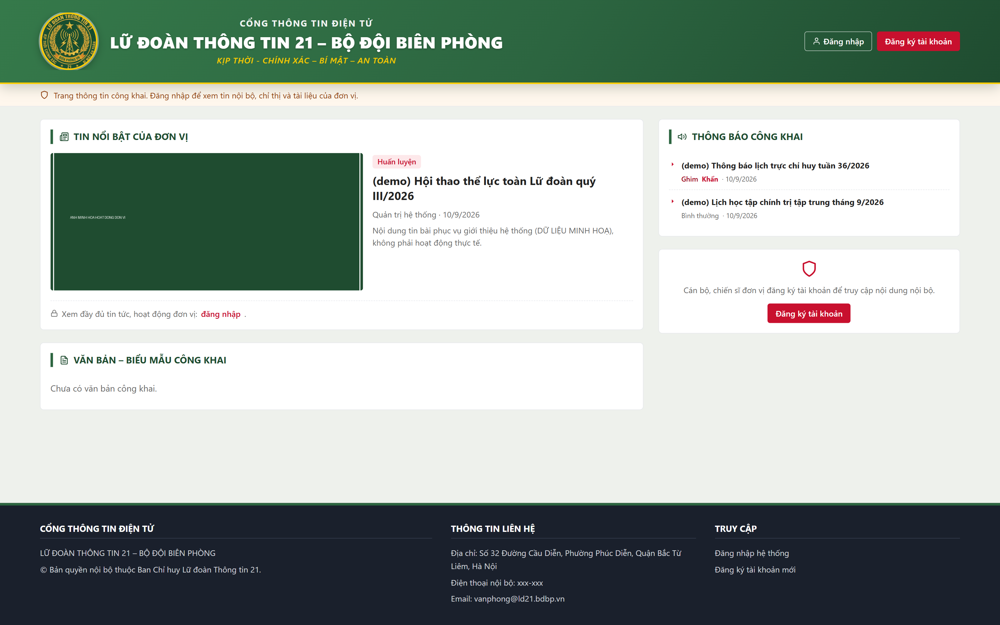

### 1.2. Tự đăng ký tài khoản

Người chưa có tài khoản có thể tự đăng ký. Tài khoản mới ở trạng thái **chờ kích hoạt**, chưa đăng nhập được.

**Điểm nổi bật:**

- Chỉ nhập **tên đăng nhập**, **mật khẩu**, **họ tên** (`POST /users/register`).
- Kết quả: tài khoản `role = 5` (Người dùng), `is_active = false`; các trường Cấp bậc / Chức danh / Đơn vị để trống.
- Chỉ huy đơn vị bổ sung Cấp bậc + Chức danh + Đơn vị rồi **kích hoạt** (thiếu bất kỳ trường nào → báo lỗi 409, chưa kích hoạt được).

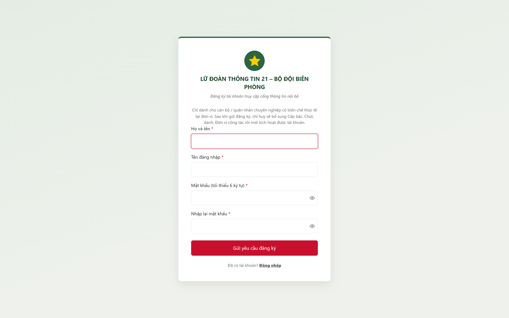

### 1.3. Đăng nhập

**Điểm nổi bật:**

- Nhập **tên đăng nhập** (chữ thường, không dấu) và **mật khẩu** do quản trị cấp.
- Sai thông tin → báo lỗi rõ ràng; tài khoản chưa kích hoạt → bị chặn (403) kèm thông báo chờ chỉ huy duyệt.
- Đăng nhập thành công → hệ thống cấp phiên làm việc có thời hạn (JWT), kèm các "cờ" quyền: vai trò `role` (0–5), quyền xem **MẬT** (`clr`), quyền **Kênh Chỉ đạo – Báo cáo** (`dca`), đơn vị công tác.

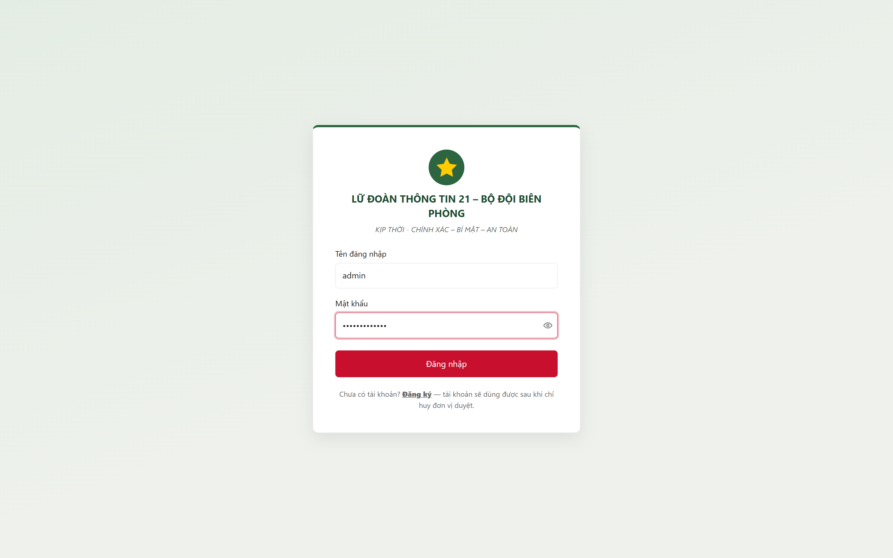

### 1.4. Bắt buộc đổi mật khẩu ngay lần đăng nhập đầu

Tài khoản vừa được cấp hoặc vừa được **đặt lại mật khẩu** bị chặn toàn bộ màn hình nội bộ cho tới khi đổi mật khẩu — không thể bỏ qua bằng cách gõ thẳng đường dẫn khác.

**Điểm nổi bật:**

- Nhập **mật khẩu hiện tại** + **mật khẩu mới** (tối thiểu 8 ký tự, có cả chữ và số) + xác nhận.
- Sai mật khẩu cũ → 400. Đổi thành công → tự chuyển vào hệ thống, cờ `must_change_password` được gỡ.

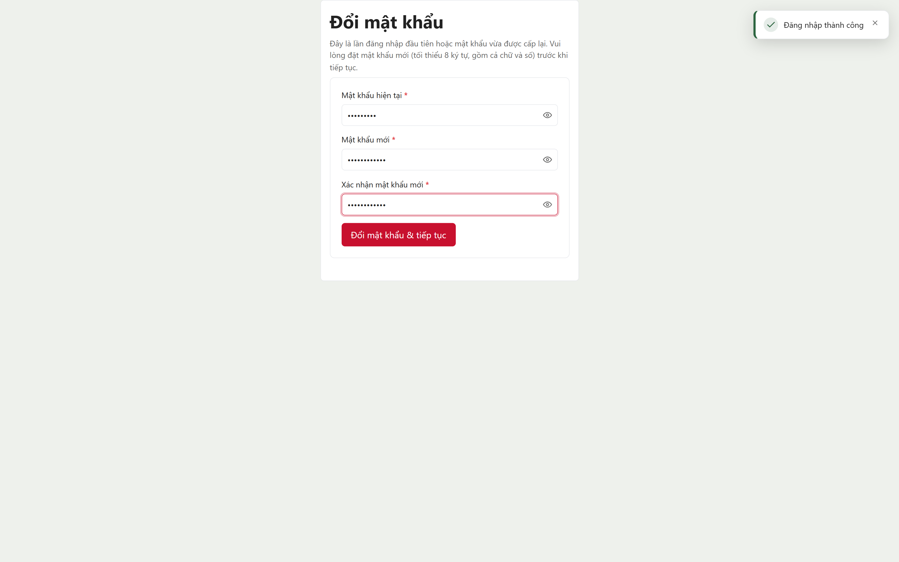

### 1.5. Bảng tin tổng hợp sau đăng nhập

Ngay sau đăng nhập, hệ thống tổng hợp tin mới nhất từ mọi phân hệ trên một màn hình duy nhất (`GET /home/summary`).

**Điểm nổi bật:**

- Cột chính: **Tin tức – Hoạt động đơn vị** và **Giáo dục chính trị** (mỗi khối tối đa 6 mục mới nhất).
- Cột bên: **Thông báo nội bộ** (kèm nhãn "Ghim", mức ưu tiên), **Chỉ thị – Nhiệm vụ mới** (kèm tỷ lệ tiếp thu `x/y quán triệt`) và **Tài liệu mới cập nhật**.
- Mỗi mục là liên kết mở nhanh sang phân hệ tương ứng.
- Thanh menu ngang chỉ hiển thị đúng những phân hệ tài khoản có quyền dùng (xem Phần 13).

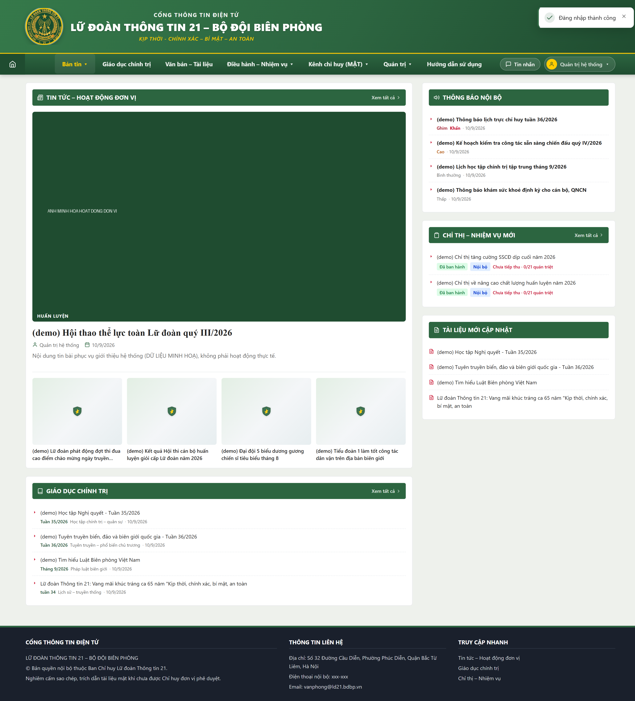

---

## PHẦN 2. BẢN TIN

### 2.1. Tin tức – Hoạt động đơn vị

Đăng bài kèm ảnh bìa, phân danh mục, gắn bậc phân loại ngay trên form. Phục vụ cả tuyên truyền công khai lẫn thông tin nội bộ.

**Điểm nổi bật:**

- Danh mục: Huấn luyện · Dân vận · Khen thưởng · Gương người tốt · Hoạt động đơn vị · Công tác Đảng · Thông tin liên lạc · Sự kiện – Lễ kỷ niệm.
- Bậc phân loại chọn ngay trên form: **Công khai / Nội bộ / Mật** — tài khoản không đủ quyền (không phải chỉ huy và không có cờ `clearance`) sẽ **không thấy** lựa chọn "Mật".
- **Luồng duyệt:** cán bộ (role 4) đăng → trạng thái **Chờ duyệt** (chưa hiển thị công khai); chỉ huy (role ≤ 3) đăng → **Đã duyệt** ngay; cán bộ sửa lại bài đã duyệt/bị trả lại → bài tự quay về **Chờ duyệt**.
- Chỉ huy duyệt/trả lại bài của người khác qua `POST /posts/{id}/review` (kèm ghi chú lý do khi trả lại).
- Tải ảnh bìa lên máy chủ (`POST /posts/{id}/thumbnail`), phục vụ qua đường dẫn `/static`.
- Phạm vi xem: khách chỉ thấy bài **đã duyệt + công khai**; cán bộ thấy thêm bài của chính mình ở mọi trạng thái; chỉ huy thấy tất cả.

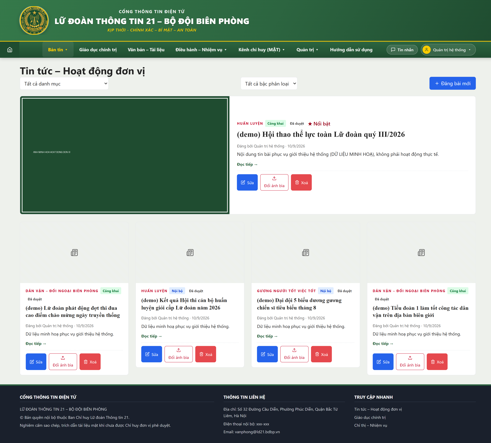

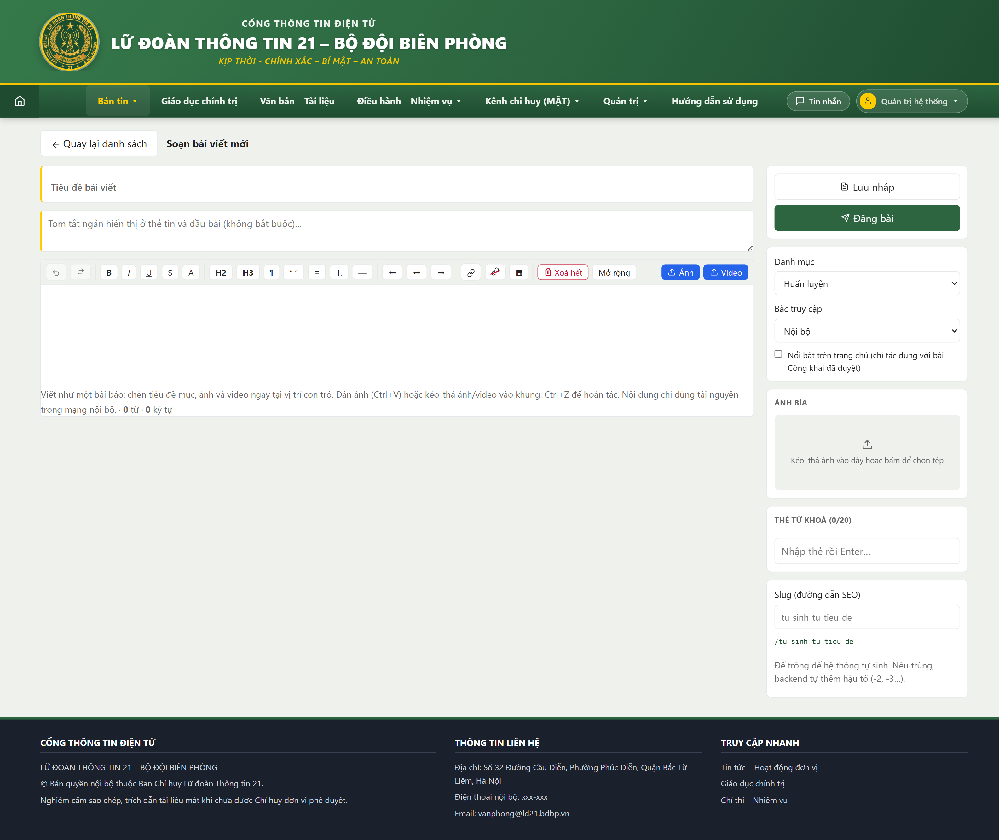

### 2.2. Thông báo nội bộ

Bảng thông báo có mức ưu tiên và ghim.

**Điểm nổi bật:**

- Mức ưu tiên: **Khẩn / Cao / Bình thường / Thấp**; tích **Ghim lên đầu** để thông báo quan trọng luôn nằm trên cùng.
- Tích **Công khai** nếu cho khách (chưa đăng nhập) xem; còn lại chỉ tài khoản đã kích hoạt thấy.
- Có thể đặt thời gian **bắt đầu / kết thúc** hiển thị.
- Danh sách sắp xếp: ghim → ưu tiên → mới nhất.
- Sửa/xoá thông báo của người khác: chỉ tác giả hoặc chỉ huy.

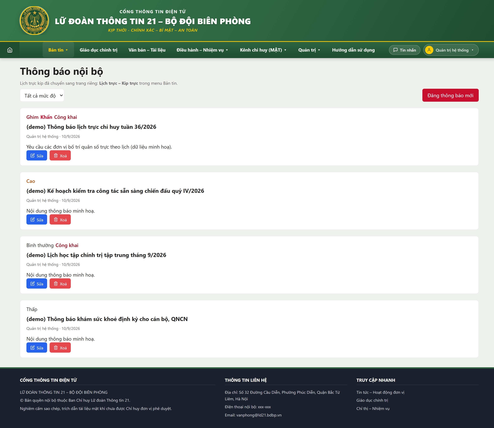

### 2.3. Danh bạ điện thoại

Kho danh bạ dùng chung, nhập theo từng **bộ danh bạ** (ví dụ "Danh bạ BĐBP 2026") từ tệp bảng tính.

**Điểm nổi bật:**

- **Nhập bộ danh bạ** từ file (`.xlsx/.xls/.csv`): đặt tên bộ, mô tả, chọn tệp → hệ thống bóc tách thành các bản ghi (họ tên, đơn vị, chức vụ, số điện thoại…).
- **Tra cứu nhanh** trong một bộ theo tên / đơn vị / chức vụ / số điện thoại.
- Xoá cả bộ danh bạ khi không dùng.

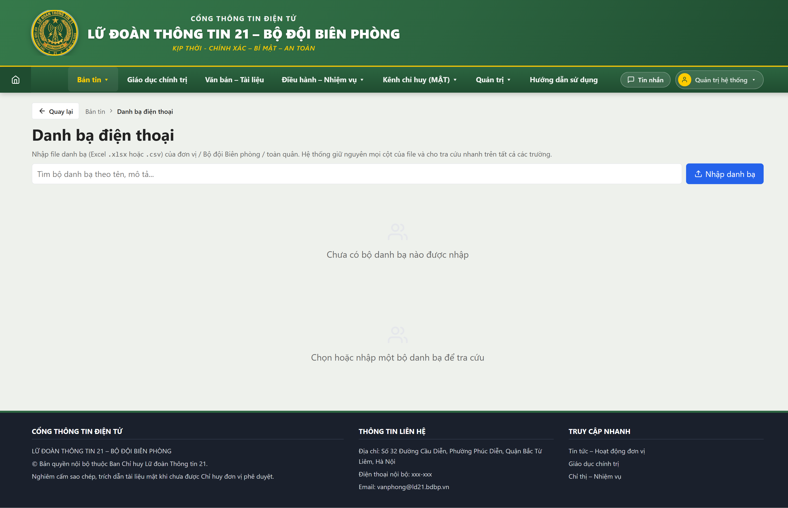

---

## PHẦN 3. VĂN BẢN – TÀI LIỆU – BIỂU MẪU

Kho biểu mẫu / quy chế / kế hoạch dùng chung, tải lên và tải về có kiểm soát công khai / nội bộ.

**Điểm nổi bật:**

- Chuyên mục cố định: Biểu mẫu · Hướng dẫn · Quy chế – Quy định · Kế hoạch · Báo cáo · Văn bản chỉ đạo.
- Tải lên định dạng `.pdf/.doc/.docx/.xls/.xlsx/.ppt/.pptx`, giới hạn dung lượng theo cấu hình `MAX_UPLOAD_MB`.
- Tải về qua `GET /documents/{id}/download` — tôn trọng bậc phân loại (khách chỉ tải được tài liệu công khai).
- Sửa/xoá tài liệu của người khác: chỉ tác giả hoặc chỉ huy.

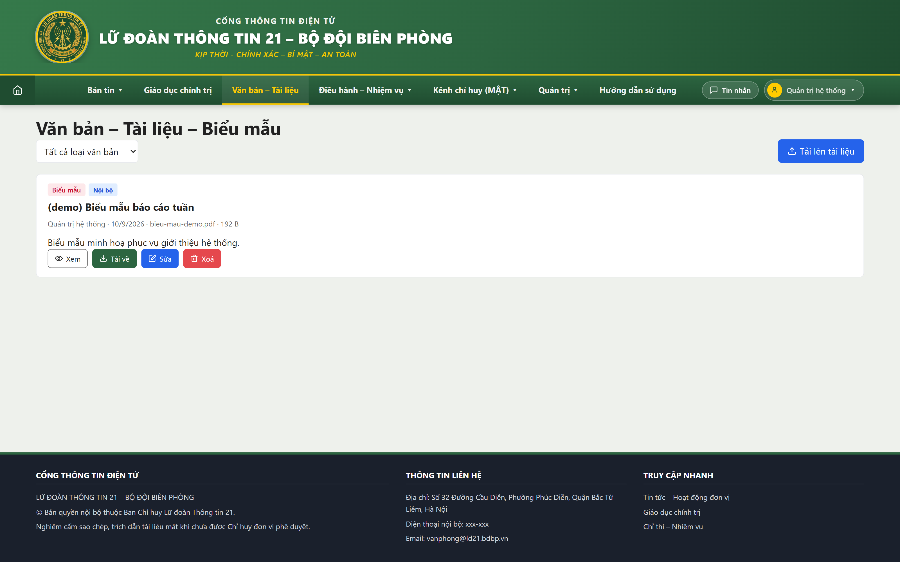

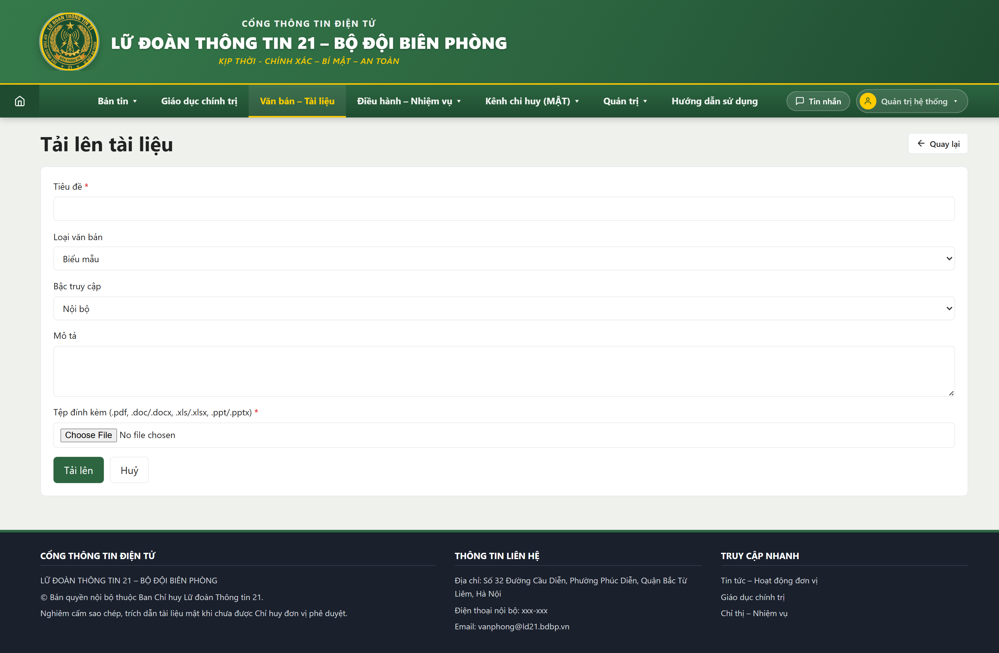

---

## PHẦN 4. GIÁO DỤC CHÍNH TRỊ

Nội dung học tập theo kỳ (tuần/tháng), gắn nhãn kỳ áp dụng để bộ đội tra cứu đúng nội dung đang học.

**Điểm nổi bật:**

- Danh mục: Học tập chính trị – quân sự · Tuyên truyền · Pháp luật biên giới · Lịch sử – truyền thống.
- Trường **Kỳ áp dụng** (ví dụ "Tuần 35/2026", "Tháng 9/2026") cho nội dung định kỳ.
- Soạn nội dung bằng trình soạn thảo văn bản có định dạng (đậm/nghiêng, tiêu đề, danh sách, chèn ảnh/video, dán liên kết) và **tự động lưu bản nháp** (xem Phần 14).
- Có thể đính kèm tài liệu học tập (`attachment_url`).
- Mọi tài khoản đã đăng nhập đều xem được; cán bộ và chỉ huy được đăng/sửa; sửa/xoá bài người khác chỉ chỉ huy.

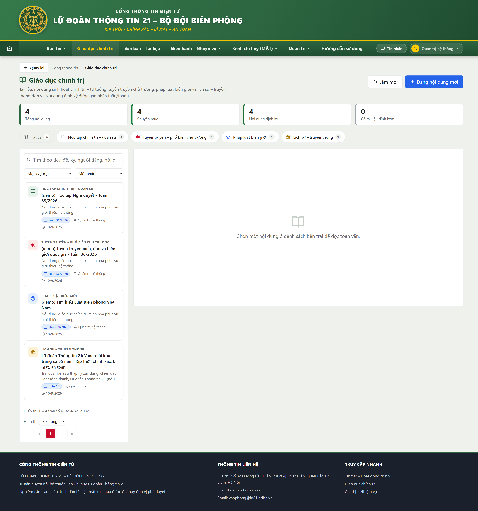

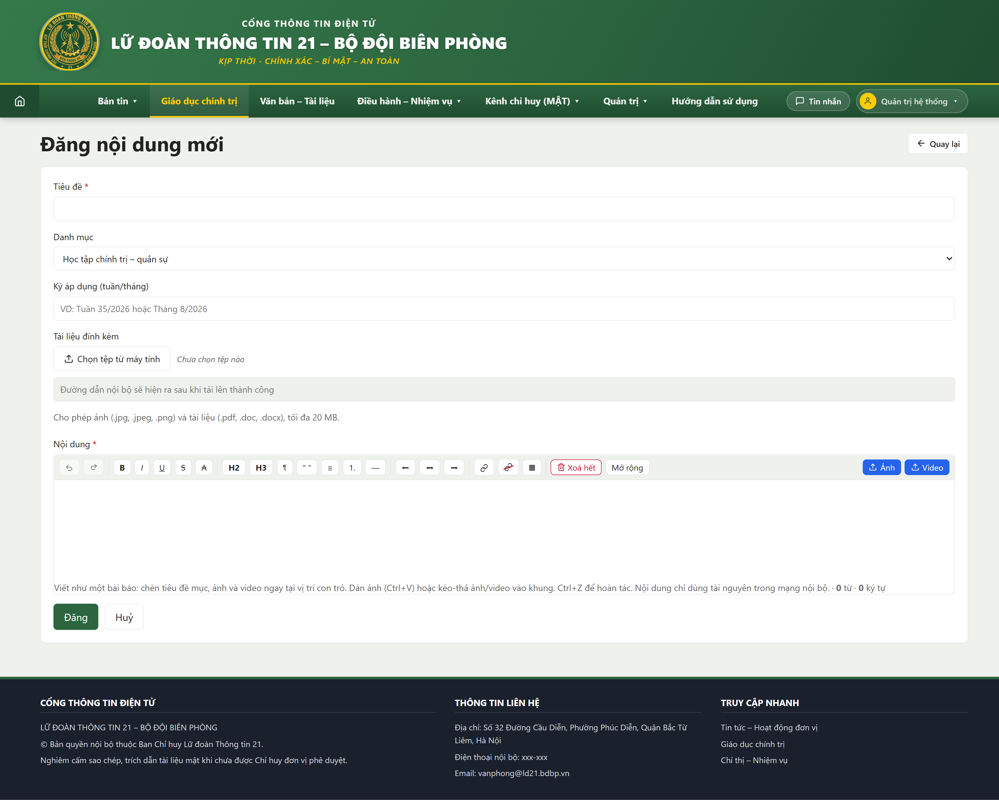

---

## PHẦN 5. CHỈ THỊ – NHIỆM VỤ

Ban hành chỉ thị với bậc phân loại, theo dõi số lượng đã / chưa "tiếp thu" theo từng chỉ thị.

**Điểm nổi bật:**

- Trạng thái: **Nháp** (chỉ chỉ huy thấy) / **Đã ban hành** (mọi tài khoản đã đăng nhập thấy — tuỳ bậc phân loại).
- Mỗi người bấm **"Tôi đã tiếp thu"** (`POST /directives/{id}/acknowledge`, idempotent) — ở danh sách hiển thị ngay tỷ lệ, ví dụ "0/2 đã quán triệt".
- Chỉ huy mở **danh sách đã / chưa tiếp thu** theo từng tài khoản đang hoạt động (`GET /directives/{id}/acknowledgements`) để đôn đốc quán triệt.
- Chỉ chỉ huy / quản trị (role ≤ 3) mới được ban hành; cán bộ và mọi tài khoản khác chỉ xem.
- Nội dung `mat` chỉ chỉ huy hoặc tài khoản có `clearance` mới xem được.

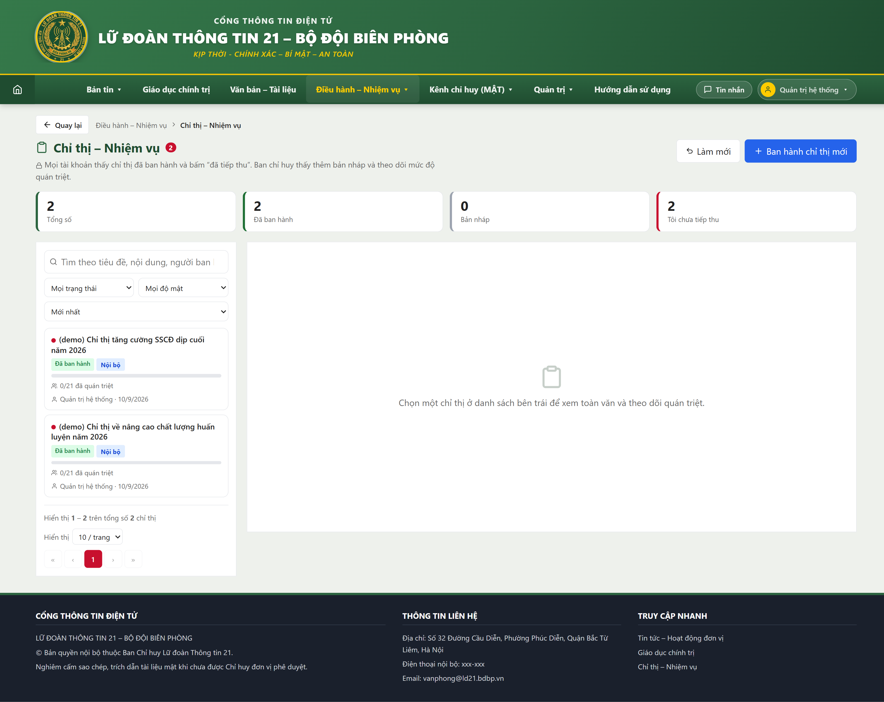

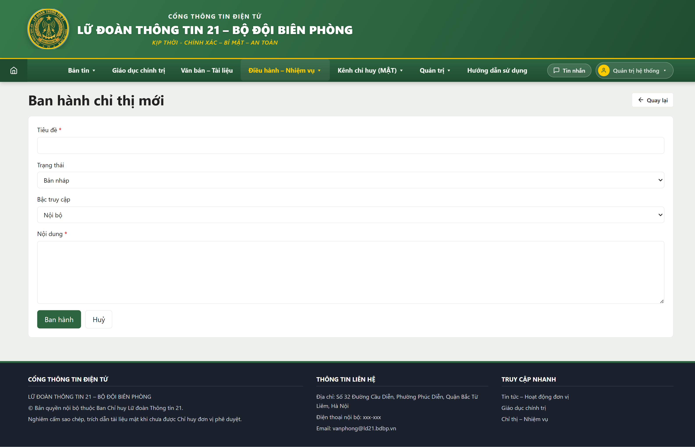

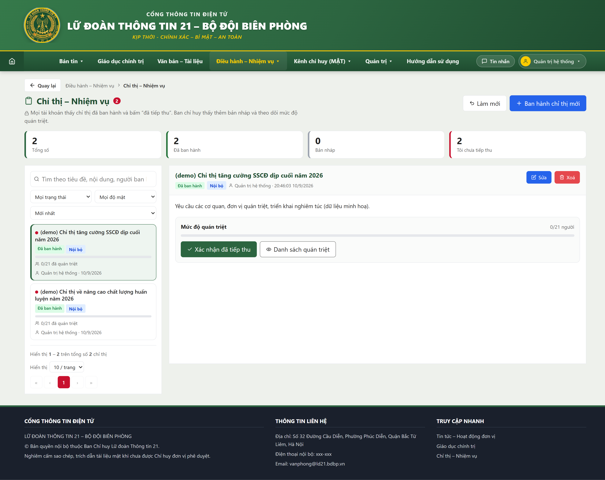

---

## PHẦN 6. LỊCH TRỰC – TRỰC BAN – BÀN GIAO CA

Truy cập ở menu **Điều hành – Nhiệm vụ → Lịch trực – Kíp trực**. Trang chia **4 thẻ**.

### 6.1. Thẻ "Biểu trực tuần" (xem tổng hợp)

- Khung nhìn 7 ngày Thứ Hai → Chủ nhật; nút **Tuần trước / Tuần này / Tuần sau**; nhãn dạng "Tuần 36/2026".
- Phạm vi xem: **Toàn Lữ đoàn** · **Khối Cơ quan Lữ đoàn** · **từng đơn vị**.
- Chú giải màu theo 7 loại trực: Trực chỉ huy · Trực ban tác chiến · Trực ban nội vụ · Trực chuyên môn · Trực ca kíp · Trực bảo vệ / vệ binh · Khác.
- Chỉ bảng trực **Đã duyệt** mới lên bảng tổng hợp cho mọi tài khoản; chỉ huy Lữ đoàn thấy mọi trạng thái (kèm nhãn) để đôn đốc. Có nút **In biểu trực**.

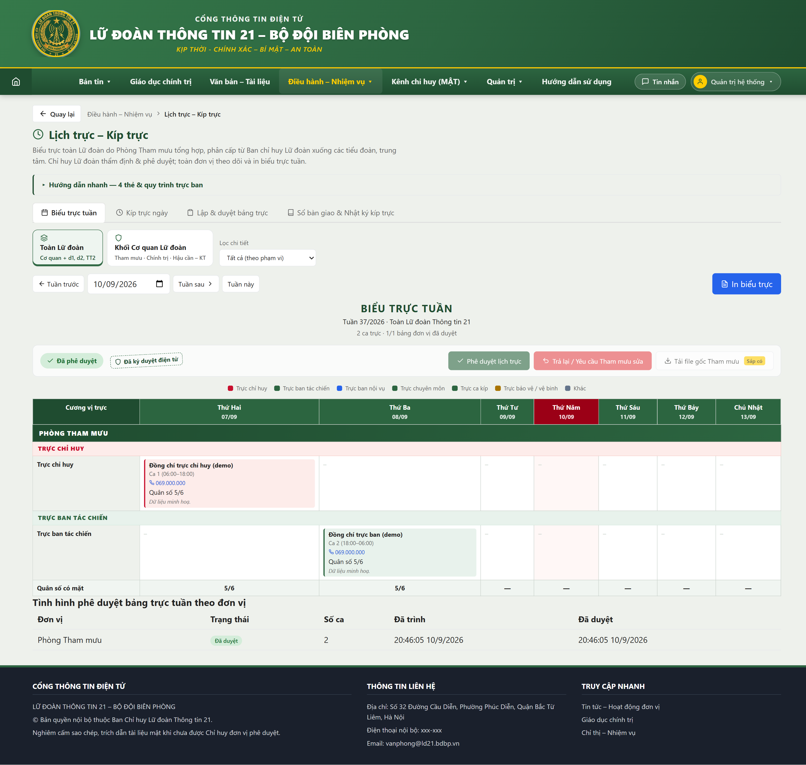

### 6.2. Thẻ "Kíp trực ngày"

- Xem chi tiết kíp trực của một ngày cụ thể, gom theo đơn vị, kèm **tổng quân số có mặt / quân số biên chế** từng kíp.

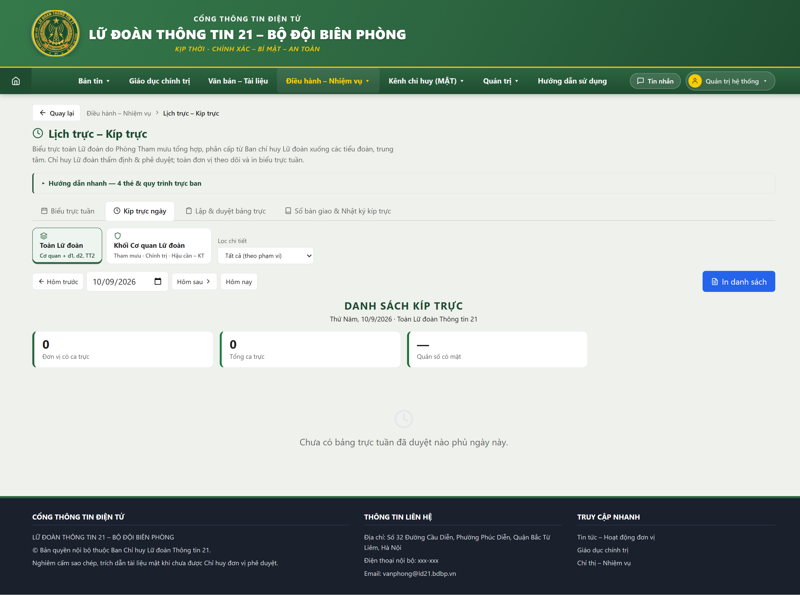

### 6.3. Thẻ "Lập & duyệt bảng trực"

- Trực ban đơn vị (thường là Phòng Tham mưu) **tạo bảng trực tuần** cho đơn vị mình, thêm từng dòng ca trực (ngày, loại trực, ca, sĩ quan trực, chức trách, số điện thoại, quân số có mặt / biên chế, ghi chú), rồi bấm **Gửi duyệt**.
- Luồng trạng thái: **Nháp → Chờ duyệt → Đã duyệt / Trả lại** (kèm lý do để Tham mưu sửa) → có thể **Mở lại**. Mỗi đơn vị chỉ có **một** bảng cho mỗi tuần.
- **Phê duyệt / trả lại** bảng trực tuần: chỉ chỉ huy / quản trị.

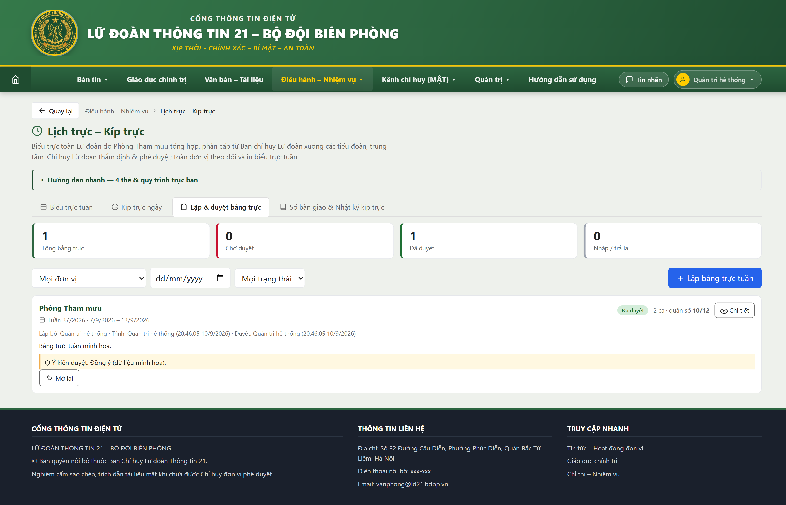

### 6.4. Thẻ "Sổ bàn giao & Nhật ký kíp trực" (bàn giao ca điện tử)

- Mỗi biên bản gắn với một dòng ca trực cụ thể. Quy trình 3 bước:
  1. **Kíp trước lập biên bản**: tình hình quân số, tình hình khí tài TTLL – vũ khí trang bị, nhật ký sự vụ / mệnh lệnh nhận trong ca, nhiệm vụ còn dở dang.
  2. **Kíp sau đối soát và ký nhận điện tử**: chọn **Đã nhận** hoặc **Có kiến nghị** (kèm ghi chú). *Chỉ người nhận được chỉ định mới ký được; người lập không tự ký; biên bản đã chốt không ký lại được (openapi v8.0.0).*
  3. **Chỉ huy ca trực kiểm tra và ghi ý kiến chỉ đạo** vào sổ.
- Trạng thái: **Chờ nhận / Đã nhận / Có kiến nghị**. Lưu vết thời gian, người giao – người nhận; tra cứu theo khoảng ngày / đơn vị / trạng thái.
- Tài khoản chỉ "xem" (role 5) không lập được biên bản (403).

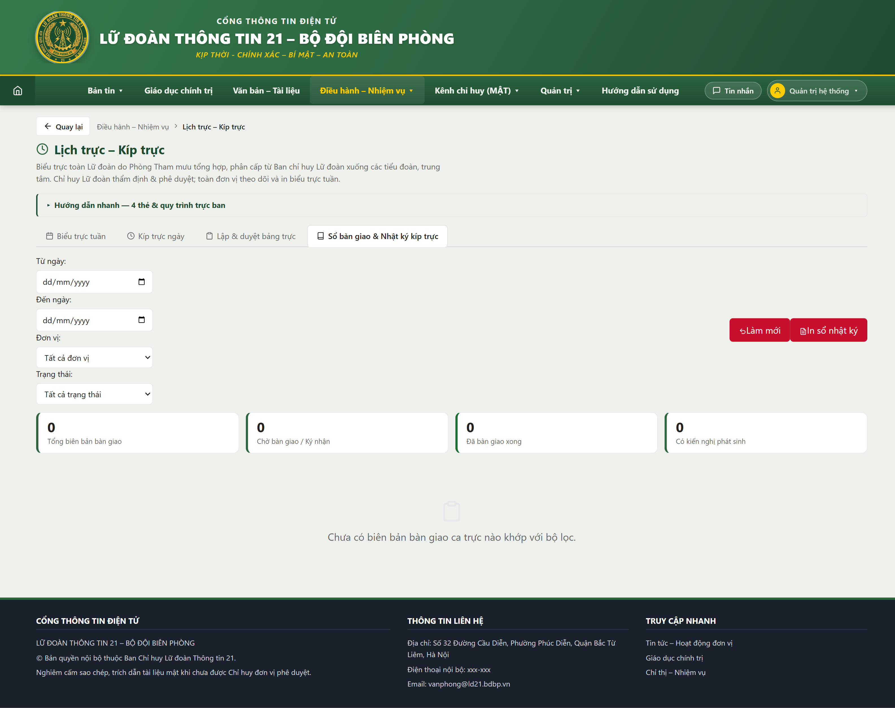

---

## PHẦN 7. TIN NHẮN TÁC CHIẾN (CHAT 1–1 & NHÓM)

Hệ thống tin nhắn nội bộ thời gian thực (WebSocket), truy cập ở nút **Tin nhắn** trên thanh trên cùng hoặc menu **Điều hành – Nhiệm vụ → Tin nhắn tác chiến**.

### 7.1. Tổng quan màn hình

- Cột trái: danh sách hội thoại (1–1 và nhóm), số tin chưa đọc, tin nhắn cuối.
- Khung giữa: dòng tin nhắn, ô soạn, đính kèm tệp/ảnh, bảng biểu tượng cảm xúc.
- Cột phải (ngăn kéo): thông tin & thành viên hội thoại.

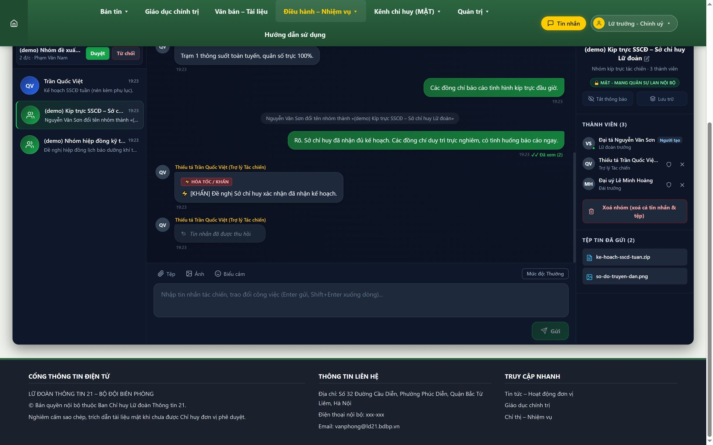

### 7.2. Nhắn tin 1–1

- Bấm **Nhắn riêng**, tìm đồng chí theo họ tên / chức danh / đơn vị (danh sách chỉ hiện tài khoản đang hoạt động), chọn để mở hội thoại.
- Gửi văn bản, tệp đính kèm; **trả lời trích dẫn** một tin; **sửa / thu hồi** tin của mình; **thả biểu tượng cảm xúc**; **ghim** tin quan trọng; **chuyển tiếp** tin sang hội thoại khác; **tìm trong hội thoại**.
- Trạng thái **đã xem**, **đang soạn tin**, **đang trực tuyến**.

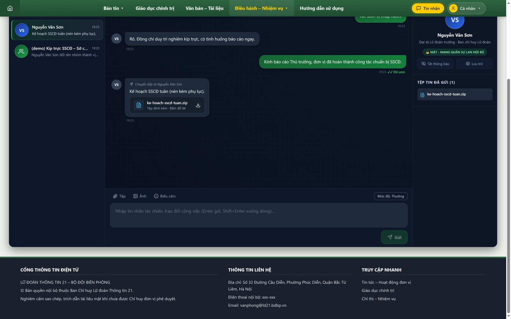

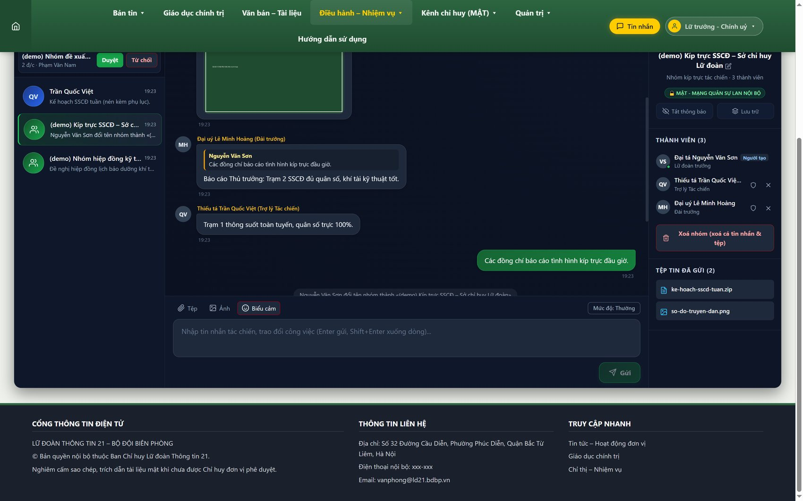

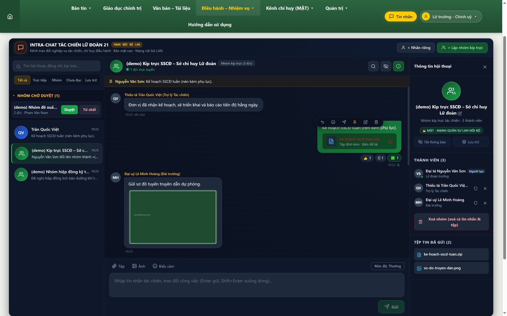

### 7.3. Nhóm kíp trực / nhóm tác chiến — có kiểm soát

- Bấm **Lập nhóm**, đặt tên, chọn thành viên → nhóm ở trạng thái **Chờ duyệt**.
- Chỉ **role 0–1** (Quản trị / Lữ trưởng – Chính uỷ) thấy danh sách nhóm chờ và **duyệt / từ chối** (từ chối bắt buộc nêu lý do).
- Sau khi được duyệt, nhóm hoạt động bình thường: **đổi tên nhóm**, **quản trị thành viên** (thêm / bớt), người tạo hoặc admin **xoá nhóm**.
- Người được thêm phải là tài khoản **đang hoạt động** (openapi v8.0.0) — chọn tài khoản đã bị khoá sẽ báo lỗi.

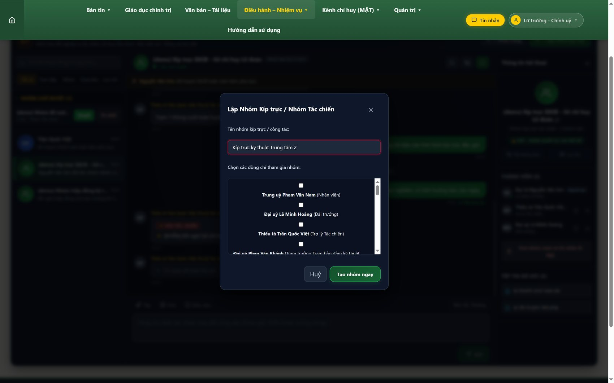

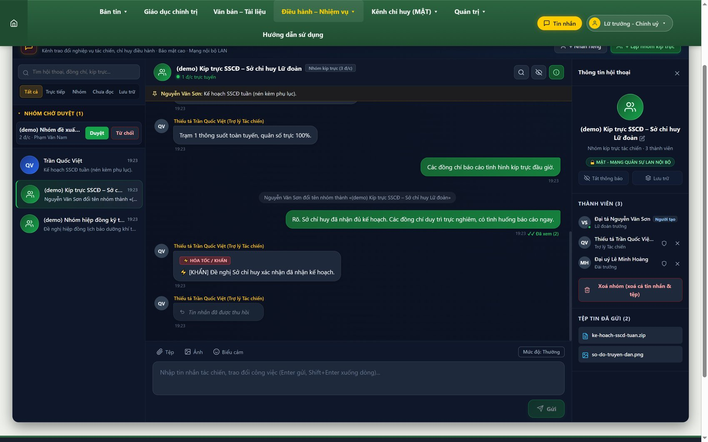

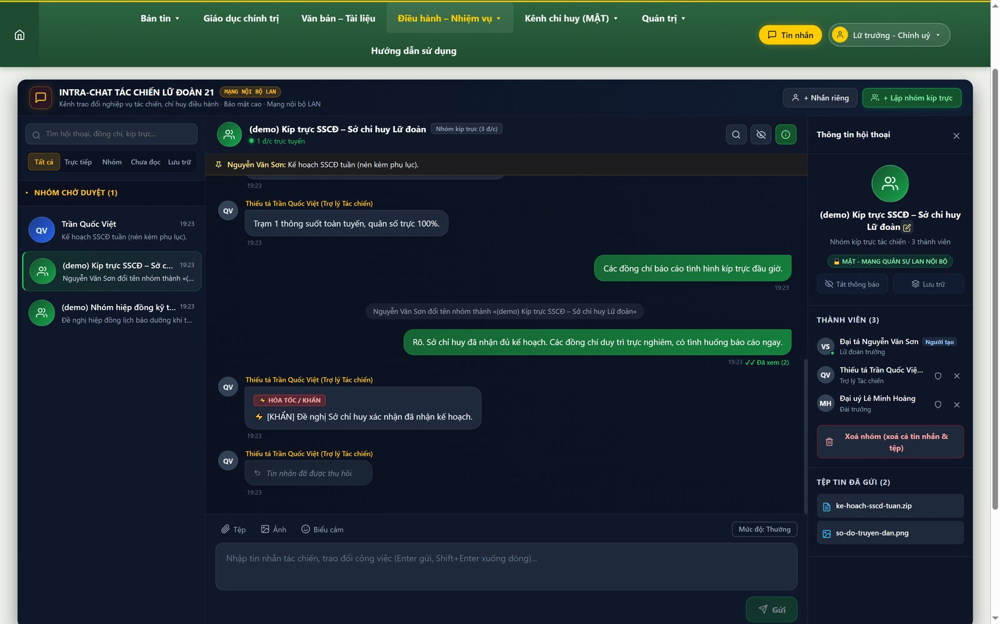

---

## PHẦN 8. KÊNH CHỈ ĐẠO – BÁO CÁO

Truy cập ở menu **Điều hành – Nhiệm vụ**. Chỉ tài khoản có cờ **Kênh Chỉ đạo – Báo cáo** (`directive_channel_access`) hoặc chỉ huy / quản trị mới thấy hai mục này.

### 8.1. Luồng trao đổi hai chiều theo đơn vị

Ban Chỉ huy mở luồng riêng cho từng đơn vị, trao đổi / báo cáo qua lại có lưu vết thời gian, người gửi.

**Điểm nổi bật:**

- BCH / chỉ huy / quản trị (và tài khoản có cờ kênh thuộc BCH Lữ đoàn) thấy **mọi luồng**; tài khoản đơn vị cấp dưới chỉ thấy luồng **của đơn vị mình** (ngoài phạm vi → 404).
- Mỗi tin nhắn có thể kèm tệp đính kèm (`/static/directive/…`).
- Theo dõi "đã đọc" qua `last_read_message_id`.
- Chỉ chỉ huy / quản trị mới **đóng luồng**; luồng đã đóng → gửi thêm trả lỗi 409.

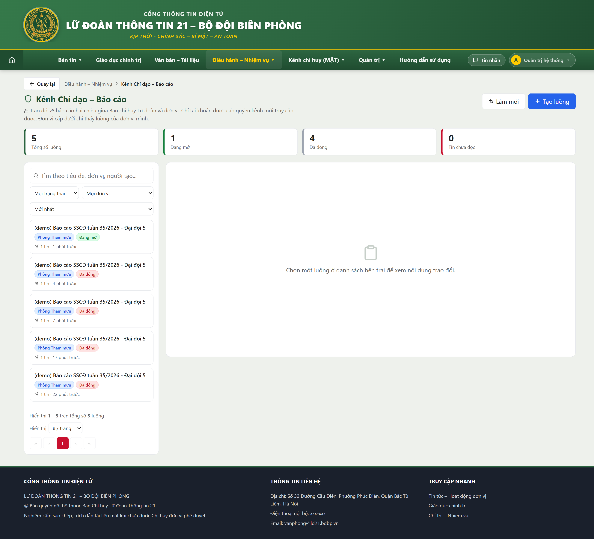

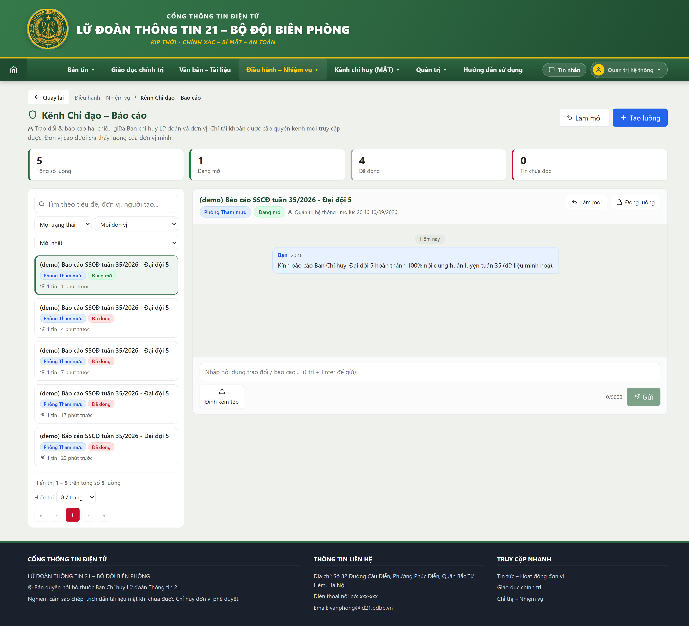

### 8.2. Giao nhiệm vụ

Nhiệm vụ gắn với Chỉ thị gốc, có hạn nộp, giao cho đơn vị (và có thể chỉ định người phụ trách).

**Điểm nổi bật:**

- Trạng thái nhiệm vụ: **Chưa giao / Đang thực hiện / Hoàn thành**; **Quá hạn** suy diễn tự động từ `due_date`.
- Mỗi đơn vị nhận nhiệm vụ có trạng thái riêng: **Chưa nộp / Chờ duyệt / Đã duyệt / Trả lại**.
- Tạo / sửa / huỷ / duyệt: chỉ chỉ huy / quản trị; **nộp báo cáo**: tài khoản thuộc đơn vị (hoặc người) được giao.
- Lịch sử nộp lưu đầy đủ (`directive_submissions`) kèm tệp đính kèm; chỉ huy ghi kết quả duyệt + nhận xét.
- Vòng đời đầy đủ (cán bộ nộp → chỉ huy duyệt) trình bày bằng tài khoản thật ở **Phần 13**.

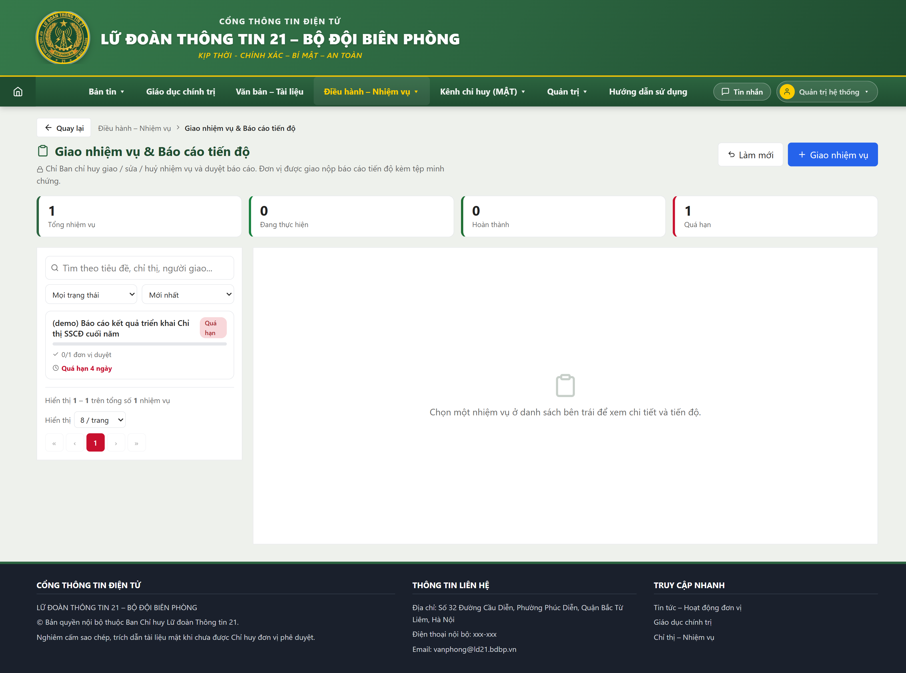

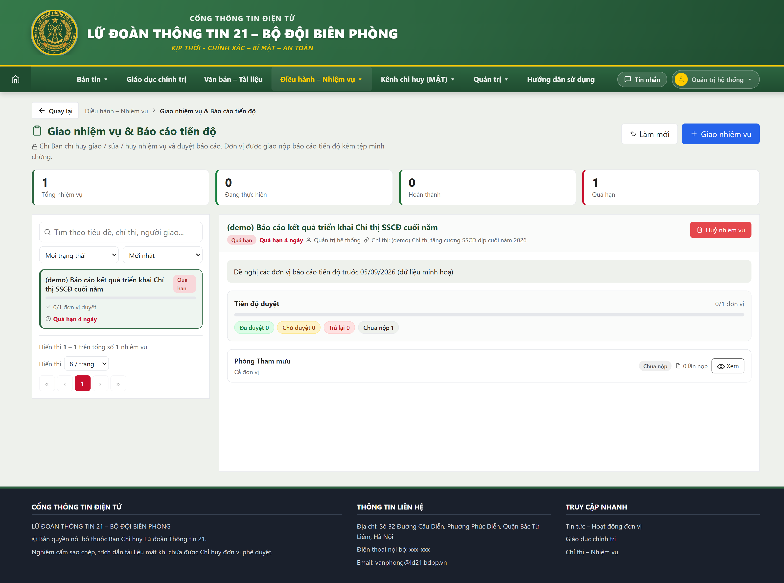

---

## PHẦN 9. KÊNH CHỈ HUY (MẬT)

Truy cập ở menu **Kênh chỉ huy (MẬT) → Trao đổi – Công văn**. Toàn bộ khu vực này gắn cứng bậc phân loại **Mật** — chỉ chỉ huy / quản trị **hoặc** tài khoản có cờ `clearance` mới truy cập được; không đủ quyền → lỗi **403** ngay tại máy chủ, không lộ sự tồn tại của nội dung. Trang có **3 thẻ**.

### 9.1. Thẻ "Bàn làm việc Chỉ đạo BCH" — Chỉ đạo, Mệnh lệnh, Giao việc của Ban Chỉ huy Lữ đoàn

Bàn làm việc theo **5 chức trách** Ban Chỉ huy: Lữ đoàn trưởng · Chính uỷ · Phó Lữ trưởng kiêm TMT · Phó Lữ trưởng HC‑KT · Phó Chính uỷ.

**Điểm nổi bật:**

- Chỉ huy (role ≤ 2) **ban hành Chỉ đạo / Mệnh lệnh**: chọn chức trách, độ khẩn (**Hoả tốc / Khẩn / Thường**), khối ngành (**Tham mưu / Chính trị / Hậu cần – Kỹ thuật / Toàn Lữ đoàn**), giao đích danh đơn vị (tuỳ chọn), hạn hoàn thành, nội dung mệnh lệnh.
- Đơn vị / trợ lý ngành **nộp báo cáo kết quả** → trạng thái chỉ đạo chuyển **Đang thực hiện → Đã báo cáo, chờ bút phê**. Tài khoản "chỉ xem" (role 5) bị chặn nộp (403).
- Ban Chỉ huy **bút phê kết luận**: **Hoàn thành** hoặc **Cần bổ sung** (kèm ý kiến, bắt buộc). "Cần bổ sung" + đơn vị nộp lại → quay về "Đã báo cáo, chờ bút phê".
- Bộ lọc theo chức trách BCH, khối / ngành, độ khẩn, trạng thái. Tài khoản role 4–5 chỉ thấy chỉ đạo giao cho đơn vị / ngành mình.

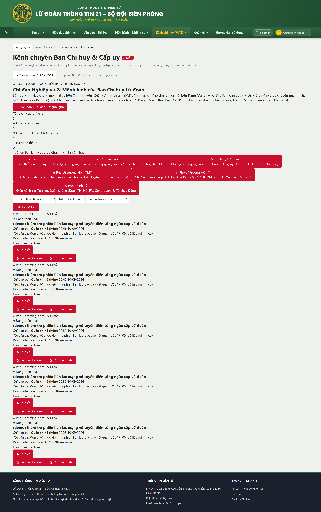

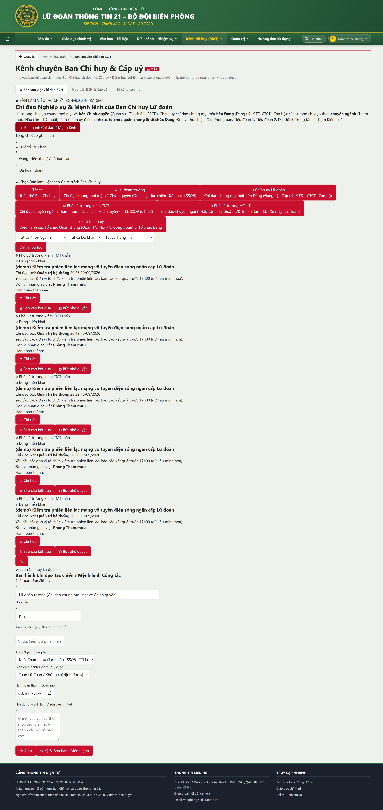

### 9.2. Thẻ "Họp bàn BCH & Cấp uỷ"

Luồng trao đổi kín giữa các thành viên BCH và Cấp uỷ, **không phân theo đơn vị**.

**Điểm nổi bật:**

- Mọi thành viên đủ quyền đều tham gia trao đổi; tin nhắn kèm tệp lưu ở `/static/command/…`.
- Tải tài liệu vào luồng; **kết xuất biên bản họp** (`minutes/generate`).
- Chỉ chỉ huy / quản trị mới **đóng luồng**; luồng đã đóng → gửi thêm trả 409. Theo dõi "đã đọc" theo từng thành viên.

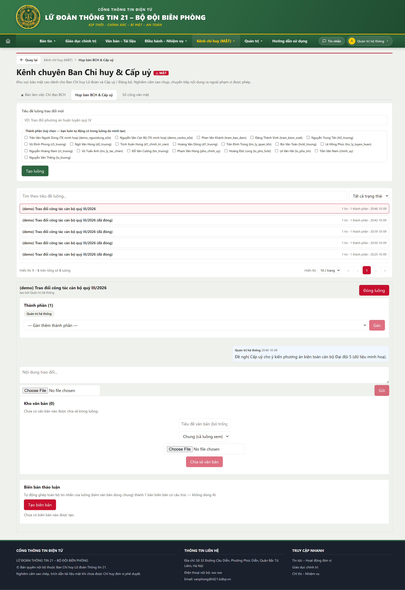

### 9.3. Thẻ "Sổ công văn mật"

Quản lý công văn đi / đến theo số ký hiệu, cơ quan ban hành / nhận, trạng thái xử lý, kèm sổ ký nhận tiếp thu từng thành viên.

**Điểm nổi bật:**

- Chiều **Đi / Đến**; số ký hiệu **unique theo từng chiều**.
- Trạng thái xử lý: **Mới / Đang xử lý / Đã xử lý / Lưu trữ**.
- **Sổ ký nhận**: mỗi thành viên bấm "Ký nhận đã tiếp thu", ghi thời điểm và phản hồi thực hiện (upsert).
- Vào sổ / sửa / xoá công văn, đóng luồng: **chỉ chỉ huy / quản trị**.
- Tải tệp công văn qua `GET /official-dispatches/{id}/download` — kiểm soát quyền riêng, **không** đi qua `/static`; mỗi lượt tải được ghi vào **Nhật ký an ninh**.

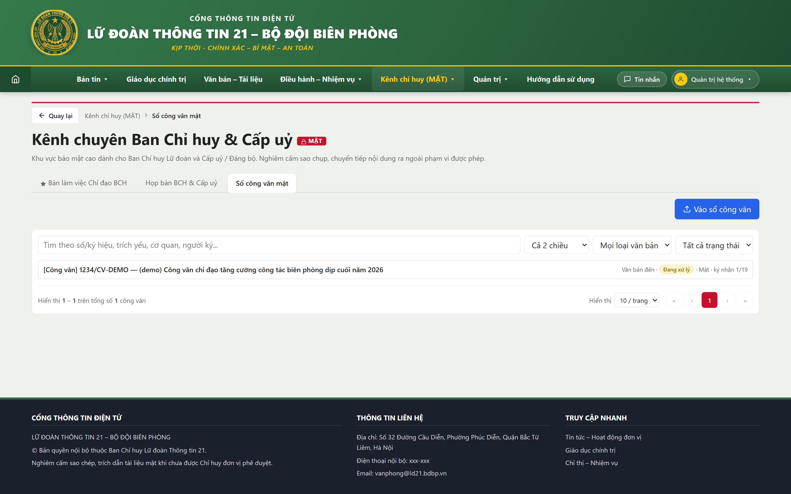

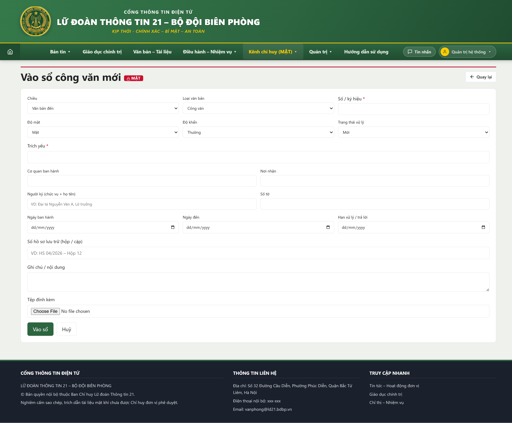

---

## PHẦN 10. QUẢN TRỊ HỆ THỐNG

Menu **Quản trị**. "Quản lý người dùng" và "Nhật ký an ninh" dành cho chỉ huy / quản trị; "Quản lý đơn vị" dành riêng cho quản trị hệ thống (role 0).

### 10.1. Quản lý người dùng

Chỉ huy / quản trị theo dõi toàn bộ tài khoản, vai trò, đơn vị, các cờ quyền truy cập kênh hạn chế trên một bảng.

**Điểm nổi bật:**

- Đổi **vai trò** (`role` số nguyên 0..5): 0 Quản trị hệ thống · 1 Lữ trưởng / Chính uỷ · 2 Phó Lữ trưởng / Phó Chính uỷ · 3 Chỉ huy đơn vị · 4 Cán bộ / QNCN (được đăng nội dung) · 5 Người dùng (chỉ xem). Chỉ role 0 mới đặt được role 0.
- Cấp / thu **Quyền xem MẬT** (`clearance`); bật / tắt cờ **Kênh Chỉ đạo – Báo cáo**.
- **Kích hoạt / khoá** tài khoản; tài khoản chờ duyệt phải đủ **Cấp bậc + Chức danh + Đơn vị** mới kích hoạt được (thiếu → 409).
- **Cấp lại mật khẩu** — tài khoản đó bị buộc đổi ở lần đăng nhập kế tiếp.
- **Nhập hàng loạt** từ tệp (Excel/CSV) theo mẫu tải sẵn; **xoá sạch tài khoản thử nghiệm** (purge, giữ nguyên `admin`).
- **Xoá hẳn tài khoản**: người gọi role ∈ {0,1,2} và chỉ xoá được tài khoản mục tiêu role ∈ {3,4,5}. Chặn: tự xoá mình, tài khoản `is_system`, tài khoản chỉ huy đang hoạt động cuối cùng, tài khoản đã gắn nội dung đã đăng (khuyên dùng "khoá").
- Ràng buộc an toàn: không tự hạ quyền / khoá chính mình; luôn giữ ≥ 1 tài khoản chỉ huy (role ≤ 3) đang hoạt động; tài khoản `is_system` được bảo vệ chống khoá / hạ quyền / xoá (409).

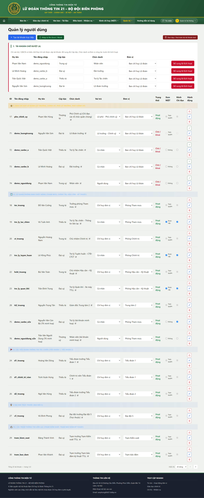

### 10.2. Quản lý đơn vị

Quản trị hệ thống (role 0) quản lý cơ cấu đơn vị chuẩn của Lữ đoàn.

**Điểm nổi bật:**

- Loại đơn vị: Phòng / Ban · Tiểu đoàn · Đại đội · Trạm · Ban Chỉ huy Lữ đoàn · Cấp uỷ.
- Cơ cấu chuẩn seed sẵn: Ban chỉ huy Lữ đoàn, Cấp uỷ – Đảng bộ, Phòng Tham mưu, Phòng Chính trị, Phòng Hậu cần – Kỹ thuật, Tiểu đoàn 1, Tiểu đoàn 2, Đại đội 5, Trạm bảo đảm, Trung tâm 2.
- Đơn vị là căn cứ để gán tài khoản và để BCH giao nhiệm vụ / nhận báo cáo theo đơn vị.

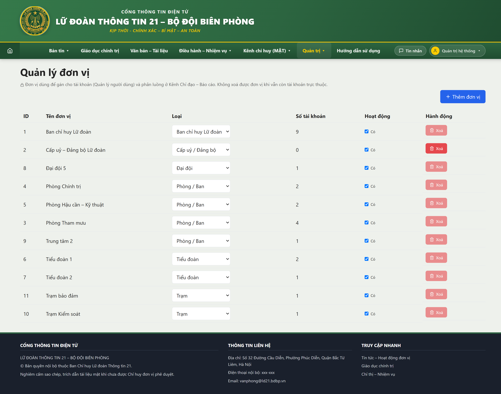

### 10.3. Nhật ký an ninh

Sổ ghi vết các hành động nhạy cảm về an ninh — chỉ huy / quản trị xem (`GET /audit-logs`).

**Điểm nổi bật:**

- Ghi vết: Đăng nhập thành công / thất bại, **Tải công văn mật**, Kích hoạt / Khoá tài khoản, Thay đổi vai trò, Cấp / Thu hồi cơ mật, cấp / thu quyền Kênh Chỉ đạo, quyền Kênh chỉ huy, Đặt lại mật khẩu.
- Mỗi dòng lưu: thời gian, người thực hiện, đối tượng tác động, **địa chỉ IP**, chi tiết, kết quả (Thành công / Thất bại).
- Bộ lọc theo loại hành động, nhóm đối tượng, từ khoá (IP / họ tên / chi tiết), phân trang.

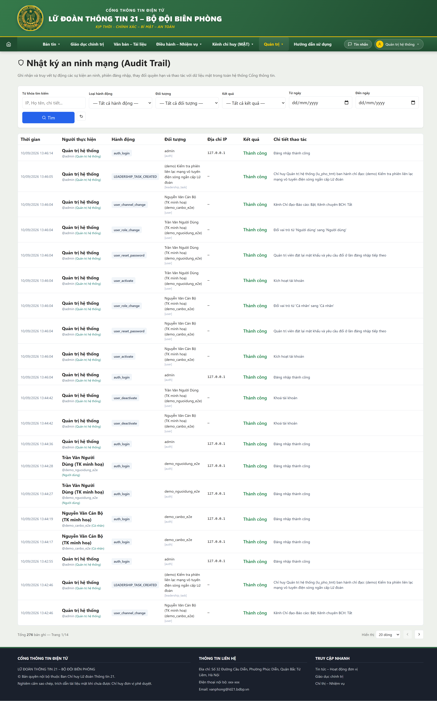

---

## PHẦN 11. HỒ SƠ CÁ NHÂN

Mỗi tài khoản tự quản lý thông tin và đổi mật khẩu của chính mình (menu tài khoản góc phải trên → **Hồ sơ**).

**Điểm nổi bật:**

- Xem tên đăng nhập, vai trò, cấp bậc, chức danh, đơn vị; sửa **họ tên** (`PUT /profile/me`).
- **Đổi mật khẩu**: nhập đúng mật khẩu hiện tại + mật khẩu mới (≥ 8 ký tự, có cả chữ và số); sai mật khẩu cũ → 400.
- Xem nhanh các quyền đang có (`GET /profile/permissions`).

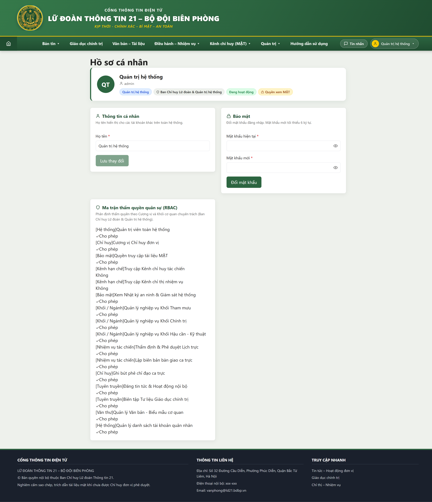

---

## PHẦN 12. TÀI LIỆU HƯỚNG DẪN TÍCH HỢP SẴN TRONG PHẦN MỀM

Mục **Hướng dẫn sử dụng** ngay trên thanh menu — không cần tài liệu rời, bộ phận kỹ thuật và người dùng tra cứu trực tiếp trong lúc thao tác. Gồm **4 thẻ**:

1. **Kiến trúc phần mềm**
2. **Hạ tầng mạng nội bộ (LAN)** — khởi động 1‑Click, sao lưu định kỳ
3. **Thiết lập máy trạm & người dùng**
4. **Cẩm nang xử lý sự cố**

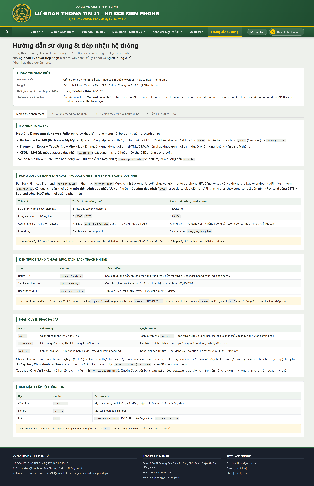

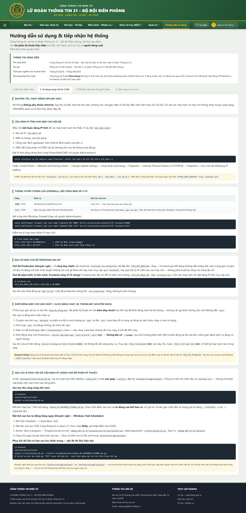

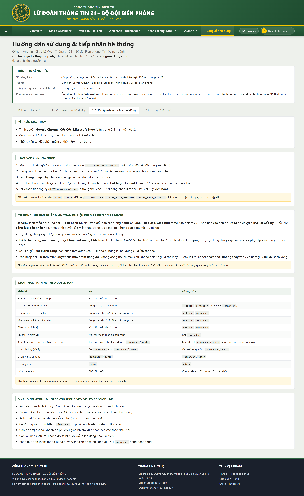

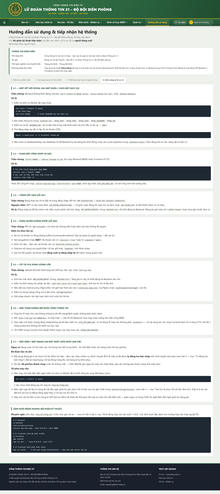

---

## PHẦN 13. PHÂN QUYỀN ĐƯỢC THỰC THI THẬT — KHÔNG CHỈ MÔ TẢ TRÊN GIẤY

Đây là phần quan trọng nhất để Chỉ huy đơn vị **tin tưởng** hệ thống: các minh chứng dưới đây thực hiện bằng **tài khoản thật khác nhau** (một tài khoản Cán bộ `role = 4` và một tài khoản Người dùng `role = 5` được tạo mới, **không** dùng tài khoản quản trị) — chứng minh phân quyền hoạt động đúng ở **tầng máy chủ**, không phải chỉ ẩn / hiện nút trên giao diện.

### 13.1. Thanh menu tự ẩn đúng theo quyền hạn

- Tài khoản **quản trị** thấy đầy đủ: có "Kênh chỉ huy (MẬT)", "Quản lý người dùng", "Quản lý đơn vị", "Nhật ký an ninh".
- Tài khoản **Cán bộ** (`role = 4`, được cấp cờ Kênh Chỉ đạo – Báo cáo, **không** có quyền xem Mật) chỉ thấy đúng phần việc của mình.
- Tài khoản **Người dùng** (`role = 5`) chỉ thấy các mục xem nội bộ, **không** có nút đăng bài.

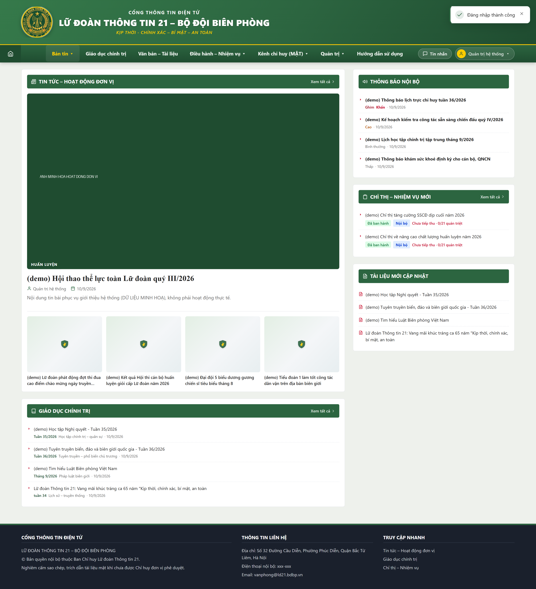

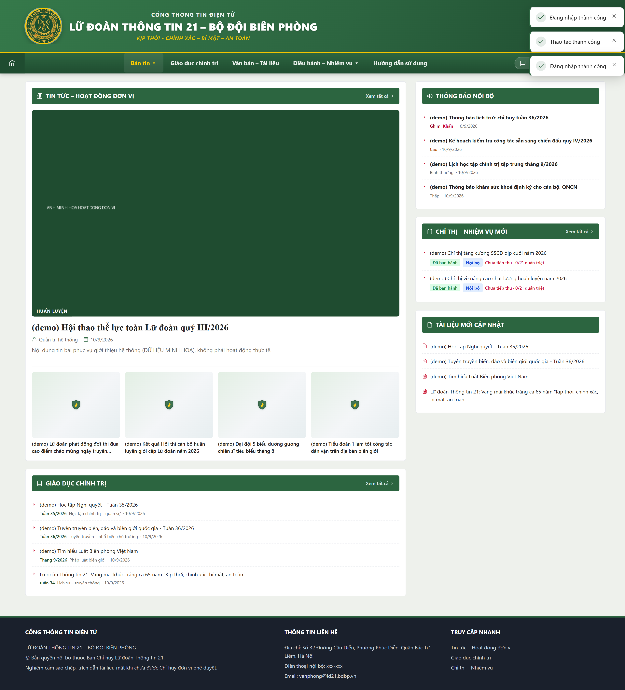

### 13.2. Vượt quyền bị chặn ở máy chủ dù gõ thẳng đường dẫn

- Người dùng `role = 5` mở form đăng bài → bị chặn, không đăng / không lưu được.
- Các thẻ **Họp bàn BCH & Cấp uỷ** và **Sổ công văn mật** trong Kênh chỉ huy (MẬT) yêu cầu `has_secret_clearance` — tài khoản không đủ quyền nhận **403** ngay tại máy chủ, không lộ nội dung.
- Với thẻ **Bàn làm việc Chỉ đạo BCH**, tài khoản `role 4–5` chỉ thấy chỉ đạo giao cho **đơn vị / khối ngành mình** (lọc ở máy chủ theo `assigned_unit_id`); menu ngang tự ẩn toàn bộ nhóm "Kênh chỉ huy (MẬT)" với các tài khoản này.

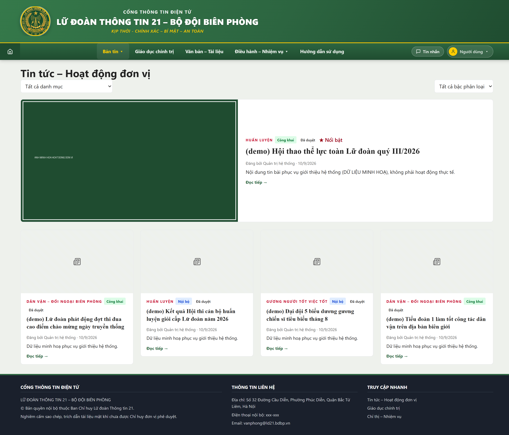

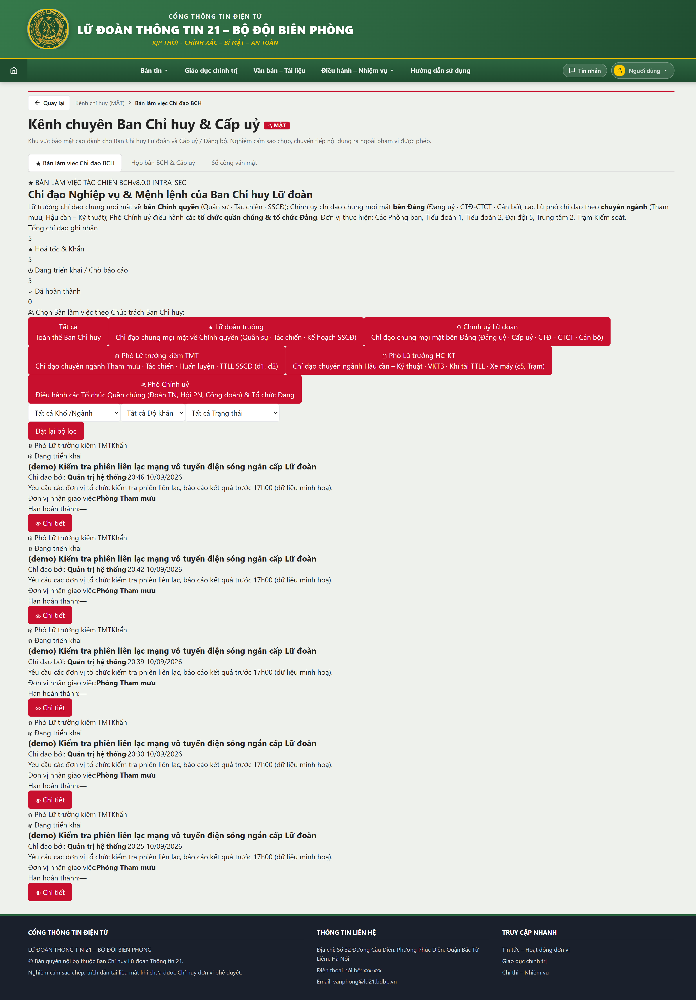

### 13.3. Vòng đời đầy đủ: cán bộ nộp báo cáo → chỉ huy duyệt

Thực hiện tuần tự bằng **hai tài khoản thật khác nhau**:

**Bước 1 — Cán bộ mở nhiệm vụ được giao cho đơn vị mình, nộp báo cáo tiến độ:**

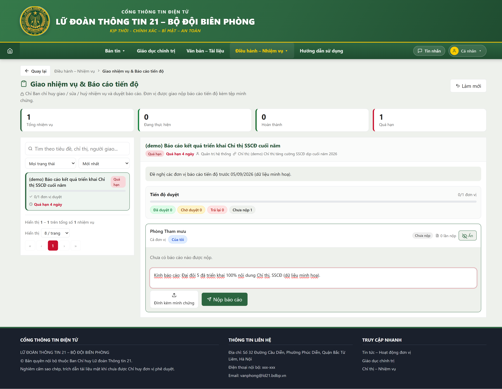

**Bước 2 — Đăng nhập lại bằng tài khoản chỉ huy: thấy ngay báo cáo chờ duyệt, bấm duyệt, trạng thái nhiệm vụ tự cập nhật "Hoàn thành":**

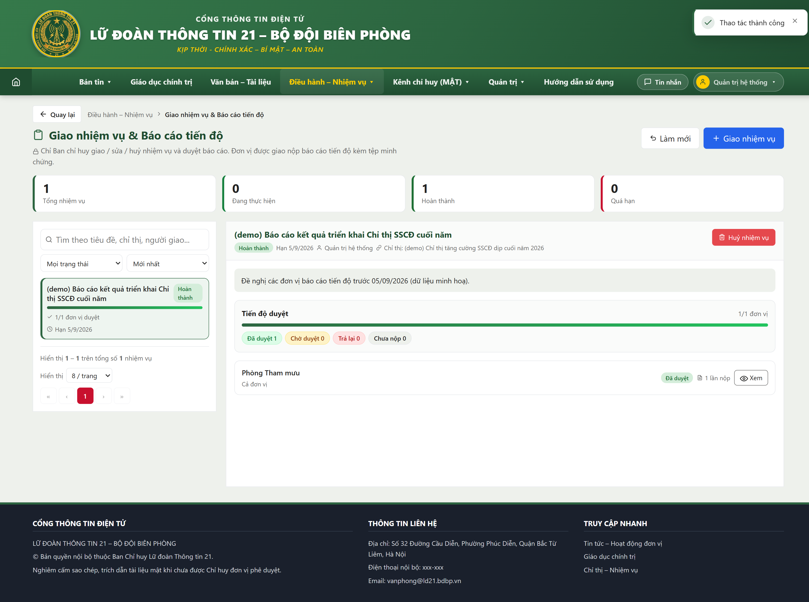

---

## PHẦN 14. CHỐNG MẤT DỮ LIỆU — TỰ ĐỘNG LƯU BẢN NHÁP

Khắc phục tình huống **mất mạng LAN hoặc tải lại trang đột ngột khi đang soạn thảo**. Áp dụng cho các form soạn dài: ban hành Chỉ thị, trao đổi / báo cáo trong Kênh Chỉ đạo – Báo cáo, Giao nhiệm vụ, Kênh chỉ huy (MẬT), Giáo dục chính trị, Tin tức.

**Bước 1 — Soạn dở một Chỉ thị mới, chưa bấm "Ban hành":**

**Bước 2 — Tải lại toàn bộ trang trình duyệt (F5), mở lại form: nội dung tự khôi phục:**

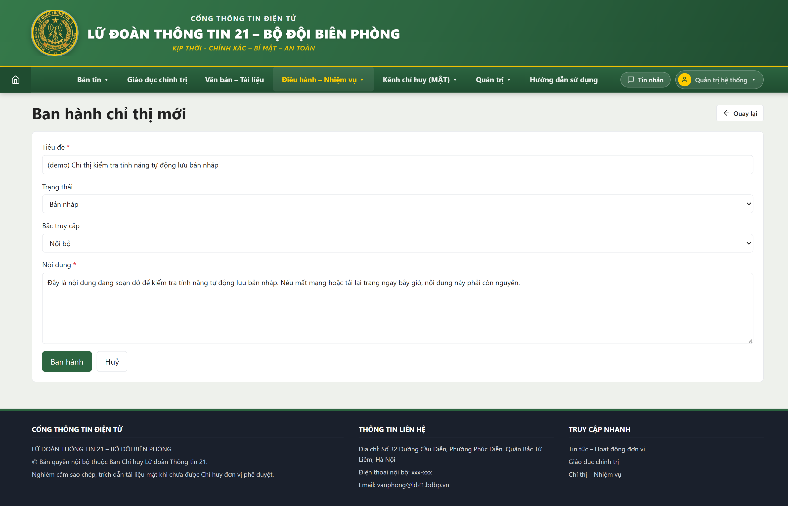

**Kết quả kiểm chứng:** kịch bản kiểm thử so sánh **từng ký tự** nội dung trước và sau khi tải lại trang — **khớp tuyệt đối 100%**.

---

## PHẦN 15. TỔNG KẾT KIỂM THỬ

Toàn bộ ảnh trong tài liệu này được chụp trong **một lần chạy kịch bản kiểm thử tự động** (`backend/scripts/capture_feature_screenshots.py`), thao tác trên hệ thống đang chạy thật (Backend + MySQL). Các luồng đã kiểm chứng:

| # | Luồng kiểm thử | Kết quả |
|---|---|---|
| 1 | Xem trang công khai không cần đăng nhập | Đạt |
| 2 | Tự đăng ký + đăng nhập qua giao diện thật | Đạt |
| 3 | Bắt buộc đổi mật khẩu lần đầu, không bỏ qua được | Đạt |
| 4 | Đăng tin bài kèm tải ảnh bìa lên máy chủ | Đạt |
| 5 | Đăng thông báo, tài liệu (kèm tải tệp), giáo dục chính trị | Đạt |
| 6 | Nhập bộ danh bạ điện thoại từ tệp và tra cứu | Đạt |
| 7 | Ban hành chỉ thị, theo dõi tỷ lệ tiếp thu | Đạt |
| 8 | Lịch trực: lập biểu trực tuần, trình duyệt, bàn giao ca điện tử | Đạt |
| 9 | Tin nhắn tác chiến: chat 1–1, lập nhóm có kiểm soát, duyệt nhóm | Đạt |
| 10 | Kênh Chỉ đạo – Báo cáo theo đơn vị, gửi tin nhắn kèm tệp | Đạt |
| 11 | Giao nhiệm vụ gắn với chỉ thị, giao cho đơn vị | Đạt |
| 12 | Bàn làm việc Chỉ đạo BCH: ban hành chỉ đạo, nộp báo cáo, bút phê | Đạt |
| 13 | Họp bàn BCH (bậc Mật), Sổ công văn mật, ký nhận tiếp thu | Đạt |
| 14 | Nhật ký an ninh ghi vết hành động nhạy cảm (kèm IP) | Đạt |
| 15 | Menu tự ẩn / hiện đúng theo quyền hạn (role 4, role 5) | Đạt |
| 16 | Vượt quyền bị chặn 403 ở máy chủ dù gõ thẳng đường dẫn | Đạt |
| 17 | Cán bộ nộp báo cáo → chỉ huy duyệt, trạng thái tự cập nhật | Đạt |
| 18 | Tự động lưu bản nháp, khôi phục sau khi tải lại trang | Đạt (khớp 100%) |

**Ghi chú phương pháp:** toàn bộ dữ liệu minh hoạ (bài viết, thông báo, chỉ thị, luồng trao đổi, công văn, tài khoản `demo_*`…) dùng để chụp ảnh được **script tự động xoá / vô hiệu hoá** ngay sau khi hoàn tất. Kịch bản có thể chạy lại bất kỳ lúc nào để tái kiểm chứng.

---

## PHẦN 16. ĐỊNH HƯỚNG PHÁT TRIỂN TIẾP THEO

Các nội dung dưới đây **chưa có** trong phiên bản hiện tại, được ghi nhận để phát triển ở các bản kế tiếp:

### 16.1. Phân quyền & bảo mật

- **Giới hạn phạm vi theo đơn vị cho Chỉ huy đơn vị (role 3):** hiện role 3 có toàn quyền chỉ huy như role 1–2, chưa bị giới hạn chỉ thao tác trong đơn vị mình. Sẽ bổ sung ràng buộc phạm vi (chỉ thấy / duyệt nội dung, nhiệm vụ, bảng trực của đơn vị trực thuộc).
- **Ký số / xác thực hai lớp (2FA)** cho các thao tác ở Kênh chỉ huy (MẬT): vào sổ công văn, bút phê chỉ đạo.
- **Nhật ký an ninh mở rộng:** ghi vết thêm cho thao tác đăng / sửa / xoá nội dung, xuất báo cáo nhật ký ra tệp.

### 16.2. Nghiệp vụ

- **Chỉ thị – Nhiệm vụ:** nhắc hạn tự động, thống kê mức độ quán triệt theo đơn vị, kết xuất báo cáo tổng hợp.
- **Lịch trực:** đồng bộ lịch trực với thông báo (tự tạo thông báo khi biểu trực được duyệt), xuất lịch trực PDF/Excel theo mẫu đơn vị.
- **Bàn làm việc Chỉ đạo BCH:** bảng theo dõi tiến độ tổng hợp theo chức trách, cảnh báo chỉ đạo quá hạn.
- **Tìm kiếm toàn văn** xuyên suốt các phân hệ (tin tức, tài liệu, chỉ thị, công văn).
- **Báo cáo – thống kê:** trang tổng hợp số liệu hoạt động đơn vị theo tuần / tháng / quý.

### 16.3. Tích hợp & vận hành

- **Thông báo đẩy** (push) tới máy trạm / thiết bị di động khi có chỉ thị mới, nhiệm vụ mới, tin nhắn.
- **Ứng dụng di động** (đọc tin, nhận thông báo, xác nhận tiếp thu) dùng trong mạng nội bộ.
- **Kiểm thử tự động E2E cho toàn bộ phân hệ nội dung** (`scripts/test_content_modules.py`) và **pipeline CI/CD** chạy toàn bộ bộ kiểm thử trước mỗi lần phát hành (xem `backend/TASK_BACKLOG_BE.md`).
- **Sao lưu — phục hồi tự động định kỳ** có kiểm chứng khôi phục, cảnh báo khi sao lưu thất bại.

---

*Tài liệu kèm theo: `BAO_CAO_THUYET_MINH_SANG_KIEN.docx` (thuyết minh sáng kiến), `docs/HUONG_DAN_SU_DUNG.docx` (hướng dẫn cài đặt / vận hành chi tiết), `DANH_SACH_TAI_KHOAN.md` (tài khoản thử nghiệm), `openapi.yaml` (hợp đồng API v8.0.0), mã nguồn kịch bản kiểm thử `backend/scripts/capture_feature_screenshots.py`.*

**Đơn vị: Lữ đoàn Thông tin 21 – Bộ đội Biên phòng**
